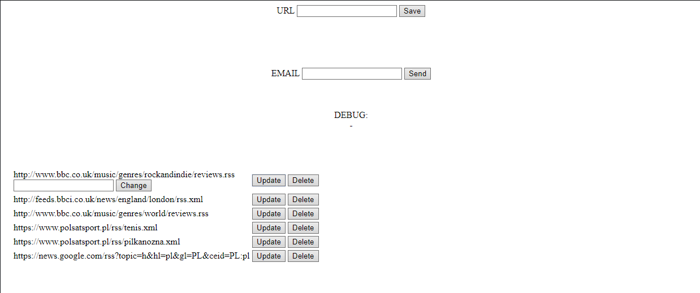
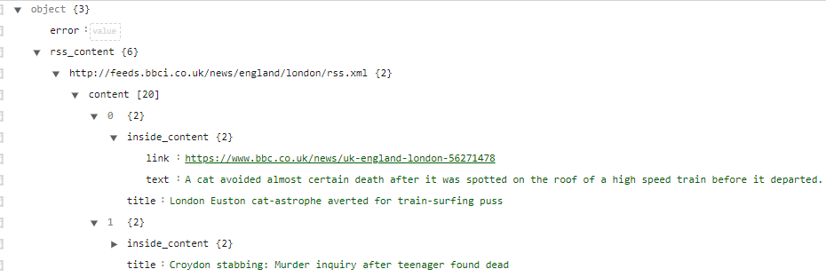

# RSS FEED SENDER #

Program allows user managing RSS addresses (adding, deleting, updating) and then send summarized news from all added RSS
URLs to given email address. Program uses JQuery for making API calls. Endpoints are listed below.

Program was tested and works up to 100 RSS addresses.

## Technologies ##

This project has been build using:

* Flask (with Jinja2 template engine)
* SQLAlchemy, Marshmallow
* JQuery
* SendGrid
* PostgreSQL database
* Jenkins and Selenium Grid ([link to my configuration](https://github.com/miloszhoc/jenkins-env))
* Selenium webdriver
* pytest
* Dockerfile and docker-compose

## Endpoints ##

All responses are JSON responses.

* GET /urls - returns URL list
* GET /urls/\<id> - returns URL details
* POST /urls - adds new URL
* DELETE /urls/\<id> - deletes URL of the given ID
* PUT /urls/\<id> - updates URL of the given ID
* GET /rss - returns the parsed summarized RSS Feed content of all RSS addresses. The example response looks like this:
  

---------

## Tests ##

Application contains:

- unit test
- integration tests
- e2e tests
- [test cases for manual testing](tests/test_cases.md)

## CI/CD ##

This project uses Jenkins as CI/CD tool. The pipeline was built in [Jenkinsfile](./Jenkinsfile) and consists of
following steps:

Step 1. Checking code for vulnerabilities with Bandit library    
Step 2. Unit tests   
Step 3. Code components integration tests    
Step 4. Application Deployment    
Step 5. Selenium E2E tests

For deploying app Jenkins uses 'Publish Over SSH' plugin. It connects to remote server via SSH, copies all files from
repository to target machine and invokes ``docker-compose build`` and ``docker-compose up -d `` commands. Before running
deployment it is required to add account to docker group with `` sudo usermod -aG docker username `` command.

Configuration file for e2e tests is [here](./tests/e2e_tests/test_config.ini).

---------

## External services ##

This application uses SendGrid API for sending emails. To learn more about SendGrid service
visit [https://sendgrid.com](https://sendgrid.com).
